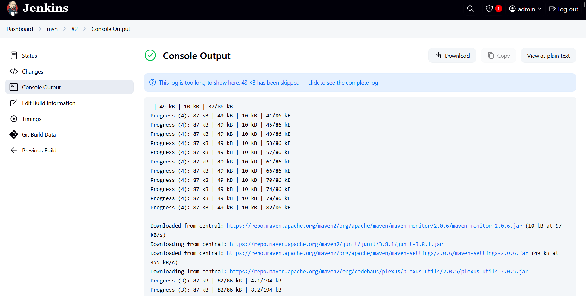

# TASK 8: Run a Simple Java Maven Build Job in Jenkins

## 🎯 Objective
  Learn how to use Jenkins to build a simple Java application using Maven — your first step into CI/CD.

---

## 🛠 Tools Used
- Docker 
- Jenkins
- Maven
- Aws EC2

---

## 🧩 Setup Steps

1. **Created Ec2 Ubuntu instance**
2. **Install Docker**
    ```bash
    sudo apt install docker.io -y
    sudo usermod -aG docker $USER
    newgrp docker
    ```
    
3. **Created Dockerfile**

    ```
    FROM jenkins/jenkins:lts

    USER root

    # Install dependencies and sudo
    RUN apt-get update && \
    apt-get install maven -y \
    apt-get clean

    # Add jenkins user to sudoers
    RUN echo "jenkins ALL=(ALL) NOPASSWD:ALL" >> /etc/sudoers
    
    # Fix permissions for Jenkins home directory
    RUN chown -R jenkins:jenkins /var/jenkins_home
    
    USER jenkins

    ```
    
4. **Build Docker Image**
    ```
    docker build -t mjenkins .
    ```
    
5. **Deploy Docker Container**
    ```
    docker run --name jenkins -p 8080:8080 -p 50000:50000 -v jenkins_home_new:/var/jenkins_home jenkins:latest
    ```

## 🧩 Jenkins Setup Steps

1. **Complete initiall process**
2. **Create New Item**
3. **Choose Freestyle and assign name**    
4. **Set git url **
    ```
    https://github.com/tommarcusbruts/hello-java-maven.git
    ```
    
5. **Build Step**
    * Choose: Invoke top-level Maven targets
    * set goal: clean package
6. **Save & Build the job**

## ✅ its done

 Console Output
  
  
  
  
